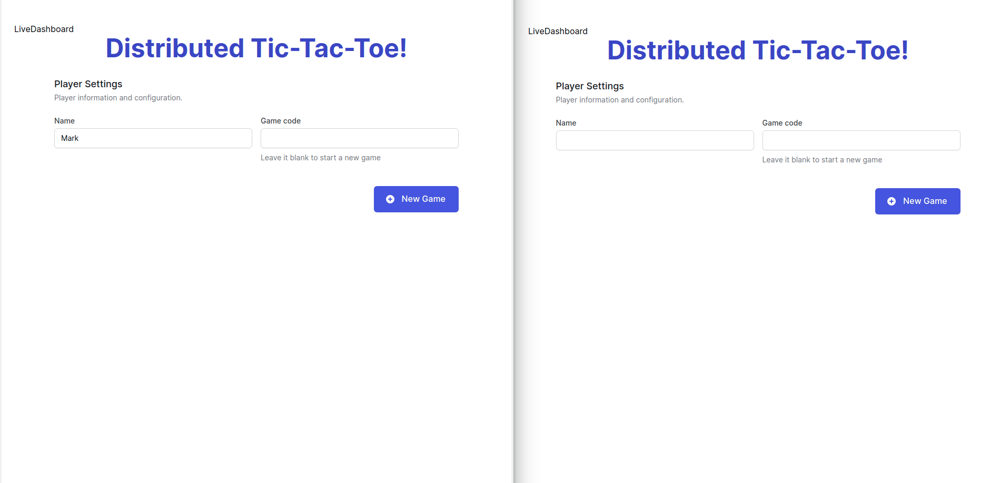
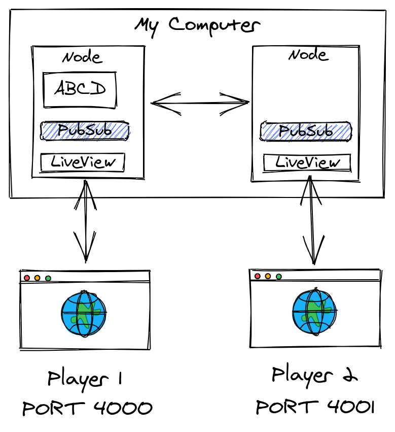
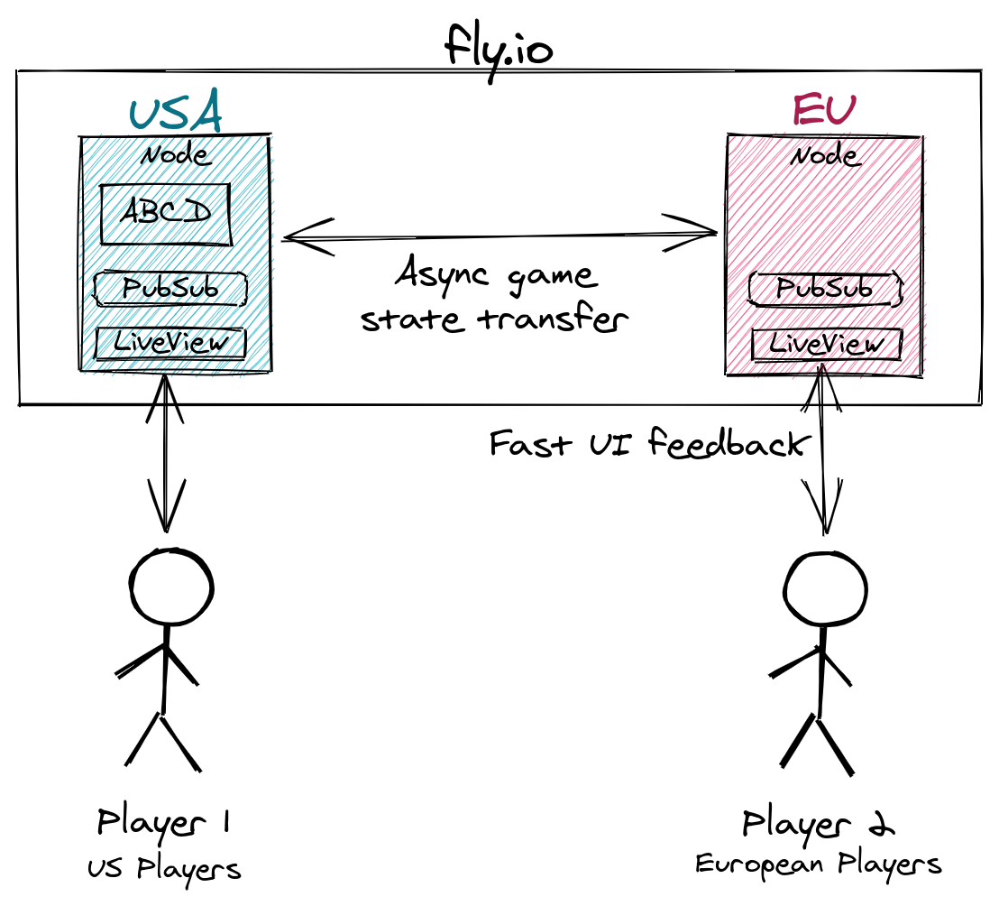

# Tictac

This is a demonstration of building a clustered, distributed, multi-player, turn-based game server written in Elixir. As designed, it plays Tic-Tac-Toe, but was designed to be extended to play almost any multi-player turn based game.

This uses Phoenix LiveView for the UI, TailwindCSS for styles, `libcluster` for clustering the nodes, `horde` for providing a distributed process registry, and [fly.io](https://fly.io) for hosting and multi-region clustering support.

You can read the blog post about it here: [fly.io/blog/building-a-distributed-turn-based-game-system-in-elixir/](https://fly.io/blog/building-a-distributed-turn-based-game-system-in-elixir/)

## Try it out locally

To try the project out locally:

  * Install dependencies with `mix deps.get`
  * Install Node.js dependencies with `npm install` inside the `assets` directory
  * Start Phoenix endpoint with `mix phx.server`

Now you can visit [`localhost:4000`](http://localhost:4000) from your browser.

Since ths is multi-player, open a second browser window to the same address. [`localhost:4000`](http://localhost:4000)

This is what a game looks like:



## Running it multi-node and clustered

To run it clustered locally, in a terminal window, run the following command:

```
PORT=4000 iex --name a@127.0.0.1 --cookie asdf -S mix phx.server
```

In a separate terminal window, run this command:

```
PORT=4001 iex --name b@127.0.0.1 --cookie asdf -S mix phx.server
```

Now in one browser window, visit [`localhost:4000`](http://localhost:4000).

From another browser window, visit [`localhost:4001`](http://localhost:4001).

You created two clients that are connected to two separate Elixir nodes which are clustered together! This is what it looks like where "ABCD" is a started game.



## Deploying it to Fly.io

Deploy this to your own Fly.io account and see it in action for yourself!

- Setup your [Fly.io account](https://fly.io/docs/hands-on/start/)
- Clone this repo
- Register your app on Fly.io

```
fly launch --name my-special-custom-name
```

- Take all the defaults. As for the region, choose `sea` (Seattle, Washington (US))
- Replace the generated `fly.toml` file with the following config but keep the `app` name that you chose for your app.

```yaml
app = "<my-special-custom-name>"

kill_signal = "SIGTERM"
kill_timeout = 5

[[services]]
  internal_port = 4000
  protocol = "tcp"

  [services.concurrency]
    hard_limit = 25
    soft_limit = 20

  [[services.ports]]
    handlers = ["http"]
    port = 80

  [[services.ports]]
    handlers = ["tls", "http"]
    port = 443

  [[services.tcp_checks]]
    grace_period = "30s" # allow some time for startup
    interval = "15s"
    restart_limit = 6
    timeout = "2s"
```

- Setup your Phoenix secrets

```
$ mix phx.gen.secret
gZNW554LeBx4VGuG2U+X3fe7OCmk28g3OIE0Ia+OFRxS7+bhEm/2ZnIvnGTRo4DO

$ fly secrets set SECRET_KEY_BASE=gZNW554LeBx4VGuG2U+X3fe7OCmk28g3OIE0Ia+OFRxS7+bhEm/2ZnIvnGTRo4DO
Secrets are staged for the first deployment
```

- Deploy!

```
fly deploy
```

- Open it in the browser

```
fly open
```

At this point you have a working system. This is where most systems stop!

## Take it Multi-Region!

Ready to take it to multiple regions? We've got one in Seattle on the West Coast, let's add one on the East Coast to cover the whole US.

- Add a region `ewr` (Parsippany, NJ (US))

```
fly regions add ewr
```

- Scale it up

```
fly scale count 2
```

- Check the Status - Re-run this command to see it balance out

```
fly status
```

- Check out the logs

```
fly logs

2021-03-31T14:28:22.880Z c9b72c04 sea [info] [info] [libcluster:fly6pn] connected to :"tictac@fdaa:0:1da8:a7b:ab3:1c48:eb59:2"
2021-03-31T14:28:22.881Z c9b72c04 sea [info] [info] Starting Horde.RegistryImpl with name Tictac.GameRegistry
2021-03-31T14:28:22.884Z c9b72c04 sea [info] [info] Starting Horde.DynamicSupervisorImpl with name Tictac.DistributedSupervisor
2021-03-31T14:28:22.890Z c9b72c04 sea [info] [info] Running TictacWeb.Endpoint with cowboy 2.8.0 at :::4000 (http)
2021-03-31T14:28:22.892Z c9b72c04 sea [info] [info] Access TictacWeb.Endpoint at https://tictac.fly.dev
```

The first log line shows the nodes are connected.

You now have a clustered Elixir application where users connect to the nearest server for them. This can provide a better user experience!



## What will you build?

Tic-Tac-Toe is a simple game. This architecture could support any multi-player turn-based game you might think of. What cool game do you want to make?

## Livebook notebooks!

I used [Livebook](https://github.com/elixir-nx/livebook) notebooks to document business logic in a regular Phoenix Web application! I created two notebooks to document how the game state works and also how a game server runs that state.

They are just plain markdown files as far as the project is concerned. Open then with Livebook and follow [this guide](https://fly.io/blog/documenting-business-logic-with-livebook/) to execute them in the context of the application.

You can find them in the `notebook` folder.